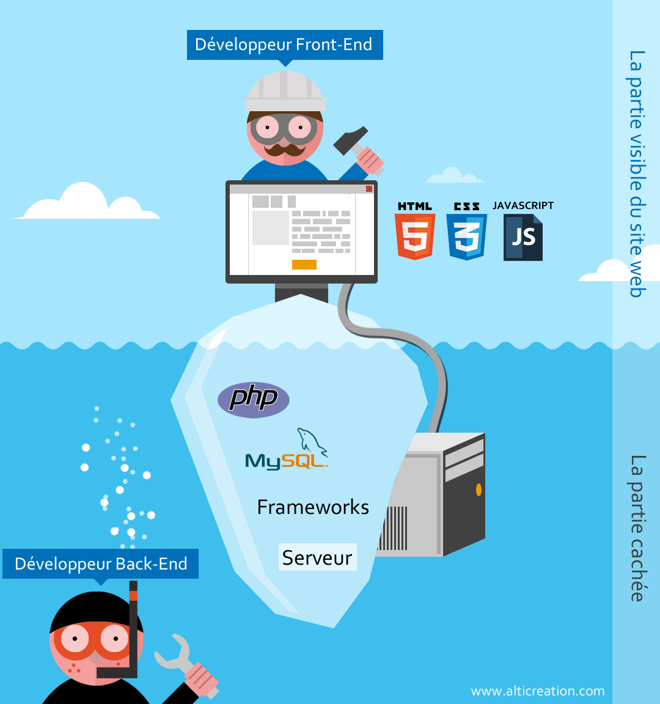

## Son métier  

- Cela fait 6 mois que Antoine travaille à décathlon, il exerce le métier de **développeur frontend**. C’est-à-dire qu’il développe l’interface de sites ou applications. Il nous a expliqué qu’il travaillait en ce moment sur l’interface d’une application. Ici c’était une application interne destiné au employés de décathlon qui travail dans les rayons. Il nous a expliqué que grâce à son code il place les boutons aux bons endroits, pour guider et faciliter le travail au maximum pour l’utilisateur.  

- Il nous a dit que la création d’une application nécessite de beaucoup de personnes, autres que des personnes exerçant le métier de développeur frontend, et qu’il faisait ainsi partie d’un écosystème. Il travaille sur **la partie visble de l'iceberg**.  

  
