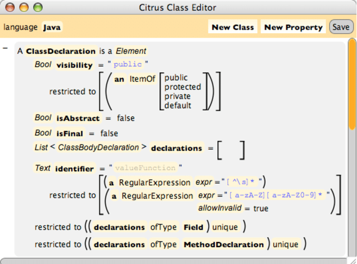

## Son métier  

- Il exerce le métier de **développeur backend**, il exerce depuis une dizaine d’années. Il travail sur la partie « cachée » d’une application. Ici il s’agit de **[API](https://en.wikipedia.org/wiki/API)**. Une application simplement pour les employés. Il communique des requêtes de navigateur. Il utilise **[salesforce](https://www.salesforce.com)**. Il nous a décrit les différentes particularités des différents langages. Il travaille sur **la partie emmergée de l'iceberg**.  

## Ses études et le language qu'il utilise  

- Il a fait une prépa puis une école d’ingénieur à Toulouse. Il utilise le **langage Java** au quotiden. Il finira par nous dire:  

> L'informatique, c'est comme les maths, c'est une matière où tu ne dois pas beaucoup apprendre mais où il faut surtout comprendre.

  

Ps: il s'agit d'une image illustrant le language Java.  
